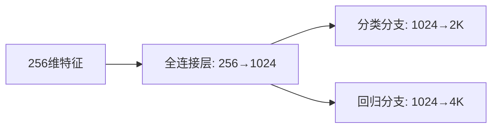

在Faster R-CNN中，从公共特征图（Shared Feature Map）到最终输出**分类分数（Class Scores）**和**边界框坐标偏移（Bounding Box Offsets）**的流程涉及**锚点机制（Anchor Boxes）**和**全连接层（Fully Connected Layers）**的巧妙设计。以下是分步解析：

---

### **1. 输入与锚点生成**
- **公共特征图**：
  通过CNN主干网络（如ResNet）提取的共享特征图，尺寸为`W × H × C`（如`38×38×256`）。
- **锚点（Anchor Boxes）**：
  - 在每个特征图位置上定义`K`个预定义的锚框（如`K=9`，含不同尺度/长宽比）。
  - **总锚点数**：`W × H × K`（如`38×38×9=12996`个锚框）。

---

### **2. 滑动窗口处理（RoI提案阶段优化）**
（注：严格来说，Faster R-CNN的RPN *替代* 了传统的滑动窗口，但仍可理解为在特征图上滑动锚点）
- **对每个锚点位置**：
  特征图上每个空间位置（共`W×H`个）对应`K`个锚框，每个锚框从`C`维特征向量（如`256`维）生成两类输出：
  1. **分类分数**（前景/背景）：`2`个分数（通过`1×1`卷积或全连接）。
  2. **坐标偏移**（相对于锚框）：`4`个值（`dx, dy, dw, dh`）。

---

### **3. 全连接层的具体操作**
假设从特征图中提取的**256维特征向量**（可能来自RPN的RoI Pooling后的固定尺寸特征，如`7×7×256`），以下是两次全连接的流程：

#### **(1) 分类分支（2K个分数）**
- **全连接层1**：`256维 → 1024维`（或其他中间维度）。
- **全连接层2**：`1024维 → 2K维`（`K`个锚框 × 2类分数（前景/背景））。
  - 输出形状：`(N, 2K)`，其中`N`为批处理样本数。
  - **意义**：每个锚框预测是否为物体（前景）或背景（如`[0.9, 0.1]`表示90%概率是前景）。

#### **(2) 回归分支（4K个坐标）**
- **全连接层1**：`256维 → 1024维`（与分类分支共享或独立）。
- **全连接层2**：`1024维 → 4K维`（`K`个锚框 × 4个坐标偏移）。
  - 输出形状：`(N, 4K)`。
  - **意义**：预测真实框相对于锚框的偏移量（公式如下）：
    $$[
    \begin{cases}
    t_x = (x - x_a)/w_a, \quad t_y = (y - y_a)/h_a \\
    t_w = \log(w/w_a), \quad t_h = \log(h/h_a)
    \end{cases}
    ]$$
    其中`(x_a, y_a, w_a, h_a)`为锚框坐标，`(x, y, w, h)`为真实框坐标。

---

### **4. 关键点图解**
#### **(1) 网络结构拆分**


#### **(2) 输出解释（以K=9为例）**
| 分支         | 输出维度  | 含义                             |
| ------------ | --------- | -------------------------------- |
| **分类分支** | `(N, 18)` | 9个锚框×2类（前景/背景）分数     |
| **回归分支** | `(N, 36)` | 9个锚框×4坐标偏移（tx,ty,tw,th） |

---

### **5. 为什么是2个分数和4个坐标？**
- **2个分数**：
  Faster R-CNN的RPN阶段仅需区分前景（物体）和背景，因此每个锚框输出2个分数（二分类）。
  - **后续改进**：在第二阶段（Fast R-CNN头部），会对正样本进一步分类为具体类别（如猫、狗）。

- **4个坐标**：
  边界框回归的本质是预测锚框到真实框的**相对偏移量**（中心点平移+宽高缩放），故需4个值。

---

### **6. 与原始滑动窗口的区别**
| **特性**         | 传统滑动窗口          | Faster R-CNN的锚点机制     |
| ---------------- | --------------------- | -------------------------- |
| **窗口生成方式** | 固定步长遍历图像      | 在特征图上预定义多尺度锚点 |
| **效率**         | 冗余计算多            | 共享卷积特征，并行处理锚点 |
| **输出**         | 每个窗口独立分类/回归 | 全连接层统一预测所有锚点   |

---

### **7. 代码示例（PyTorch风格）**
```python
import torch
import torch.nn as nn

class RPNHead(nn.Module):
    def __init__(self, in_channels=256, mid_channels=1024, num_anchors=9):
        super().__init__()
        # 共享的全连接层（或3x3卷积）
        self.conv = nn.Conv2d(in_channels, mid_channels, kernel_size=3, padding=1)
        # 分类分支：输出2×num_anchors分数（前景/背景）
        self.cls_layer = nn.Conv2d(mid_channels, 2 * num_anchors, kernel_size=1)
        # 回归分支：输出4×num_anchors坐标偏移
        self.reg_layer = nn.Conv2d(mid_channels, 4 * num_anchors, kernel_size=1)

    def forward(self, x):
        x = torch.relu(self.conv(x))
        cls_scores = self.cls_layer(x)  # 形状: [N, 2K, H, W]
        bbox_preds = self.reg_layer(x)  # 形状: [N, 4K, H, W]
        return cls_scores, bbox_preds
```

---

### **总结**
Faster R-CNN通过锚点机制和全连接层，将滑动窗口的思想转化为高效的特征图遍历：
1. **256维特征**来自共享卷积层的空间位置编码。
2. **2K分数**实现前景/背景二分类，**4K坐标**预测边界框偏移。
3. 全连接层的参数共享显著提升了效率，避免了传统滑动窗口的重复计算。

这一设计成为现代目标检测模型（如RetinaNet、YOLOv3）的基础范式。